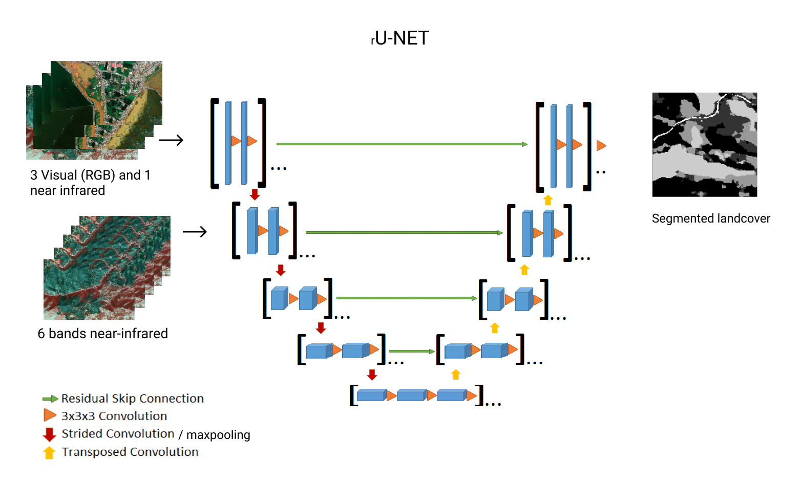

# rU-Net

This is a known model of image-segmentation, where in the dcoder, a skip-connection from the same depth in the encoder is used together with the previous decoding step.  

The images used in training have bands in both 10m and 20m resolution. In order to use both of these, Rune decided to feed them in to the network at differents "depths", stages of encoding/decoding. Since the different depths have different resolutions, this enables the network to use the image as input when the resolution of the hidden layer and the resolution of the input images match.

Skip connections from encoder to decoder are present to provide help for upscaling the encoded image, helping the segmentations to find their rightful place.

At the end of the network (not present in the figure) there is one final 1x1 convolution, and then a softmax-layer which provided probabilities for each class for each pixel. This can then be used as input to some argmax procedure to find the predicted class for each pixel.

# Concat-Temporal rU-Net

This an extension of the data that is passed to the rU-net model in order to capture temporal information. The main idea is to concatenate images together, kinda similar to adding more bands to the original image. This is possible because rU-Net is invariant to number of bands. The result of the convolutions are fixed by the defined bumber of filters.

For example if we had two months as an input a new pixel would have 8 (2x4) bands for the first month and 12 (2x6) bands for the second month.

The results of this

# Temporal CNN with Attention

This net uses an arbitrary number of months in an arbitrary permutation, to which end it can not really be viewed as a model that incorporates time-series of images. The best way to view the model would be as a smart "bag-of-images" model, using a weighted average (using attention-scores) of encoded images to classify the area.

## General architecture

(The box attention will be explained later)

For input the model takes a series of images of the same area. For now this means pictures taken per month. Each of these images are then encoded separately, with different encoders. There has been given some thought to each encoder sharing weights, but it has not been implemented (yet). So for the moment we have strong and independent encoders.

Each of these encoders uses the images of different resolutions in different layers, so that the resolutions of the images correspond to the resolution of the layer. This is due to the unsurprising impossibility to concatenate 64x64 and 32x32 images. The last convolution output at each layer is stored for use as input to the attention-layer.

In the bottom, one last pooling is made to go "below" the max depth of the network. These feature maps will be filled with zeros, and will provide a starting point for the encoder. Ideally we would want an unbiased starting-point, but it works well enough.

In the encoder, each layer `i` will be the result of merging the depper encoding `i-1` and the weighted average of all encoders in the same layer `i` using the attention scores. The last layer will just be a 1x1 convolution followed by a softmax-layer.

This grand architecture will, ideally, give good predictions on the area covered by the images. In practice, it gives OK+ predictions, which is still decent considering the state of the data and horribly horrible (lack of) labels.

## Attention Mechanism

### The Block

The block takes the last layer of encoding and the skip connections of current layer as inputs. Pairs of (skip connection, previous decoded layer) are propogated through a fully connectec neural network to get an attention score. These scores are softmaxed, and used as weights for a weighted average of the skip-connections themselves. This average is the output of the attention block.

Now you're probably asking; "but Erling, how can you use a picture in a fyllu connected layer?". Well, dear you, it's actually rather simple. We simply take the mean value of all the filters used in the model. Since this numbr is not changing over layers, we can also use this attention-block in different layers.

### From translation to decoding.

The use-case of this attention-thing is mainly for encoding/decoding series of data into series of data. This differs from our model as we only want one decoded timestep. From what I've seen those language-models only uses one attention-output per decoded word. They also reuse that attention-net for each output time-step.

As such, I thought using the same attention-net for each layer would make sense. The problem: Originally, attention-nets reuse attention-nets over time, and we're reuse them over layers. Since they are two different "axises", so to speak/write, I can't realy decide if multiple nets or single net is best. As such, this is left as an exercise to the reader.

## Road ahead

### Shared Weights

The SqueezeTime model uses same convolution-wieghts for all timesteps. Given the results of that model, sharing weights between encoders could improve the model. In practice, this would mean reusing blocks for data-processing accross encoders.

### Increasing number of feature maps

One could also force the use of different attention-networks, enabling the model to increase the number of filters in deeper layers. Considering to lack of complexity in our problem, I wouldn't recommend this as the go-to improvement.

### Encoding time

Since this is more a "bag-of-images" model, encoding time in the images could improve it's performance. This could perhaps tell the model what it should look for in the different images.

### Convolution during upscale

Atm, the only convolution in the upscaling process are the transpose convolutions. One could perhaps run them through a convolution block in each layer, helping encoding (or something). You shouldn't just add things for the sake of adding them, but can't hurt to try.

# K Nearest Neighbours

# Gaussian Mixture Model

# Decision Tree

A decision tree is a tree of nodes where each node represent an attribute. The edges leaving the node represents different splits of the attribute. For example is a node represented an isCloudy attribute then the split would be, True down one edge and False down another edge. Those edges goes to a node representing a different attribute and the process continues until no more splits are made and then we have a leaf node. A leaf node will have a majority class and this will be used as the prediction value if a query reaches this node. For more information about decision trees see: https://towardsdatascience.com/a-guide-to-decision-trees-for-machine-learning-and-data-science-fe2607241956

We made decision tree for per pixel classification using only the band values (colors) to predict the class (grass, grains or other) of the pixel.

We tested with many different values for the depth of the tree and found that a depth of 35 was best with a mean intersection over union score of 0.57. This was on 1% of the mini data set so the results are not stable. When trying all the mini data the process took to long to terminate (did not finish in a night) so the decision tree approach was abandoned.

# Other Ideas

## Clustering Algorithm

This is very similar to the GMM, so it is not really that useful to implement it. I don't think it will see any better results than those we have. Might be wrong though.

##Anti-similarity image

###Main Idea
As a way to include information of changes over time of a location we proposed the idea of making an "Anti Similarity Image".

###Making it
The anti sim image is made by computing a difference function for each pixel location, where this difference function computes the difference between months in the same location.
$\sum_{t=1}^{n}|{p_t - p_{t-1}|}$ where $p_t$ is the pixel value for a color and location at time $t$ and $n$ is number of images (months).

###Results
The use of anti sim image did not give better results than using a normal image. in fact the results were worse than random guessing, both when tried by it self and in combination with a normal picture for august. Further development of this idea was therefore not studied any further.

# Future Ideas

## SMILE

Apparently an architecture
